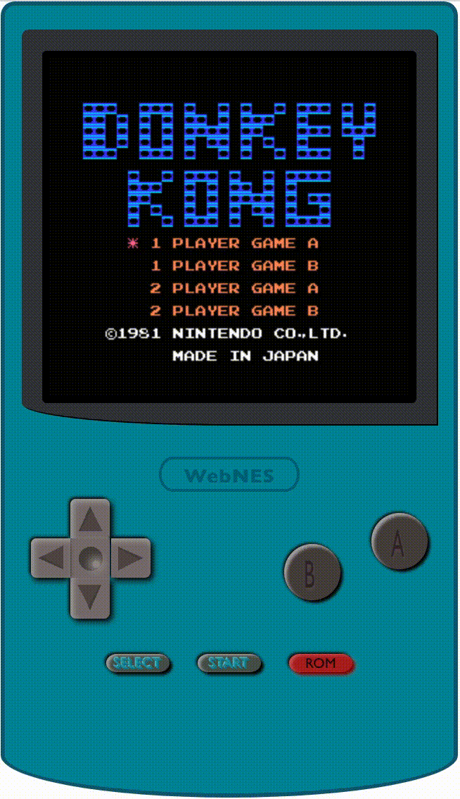
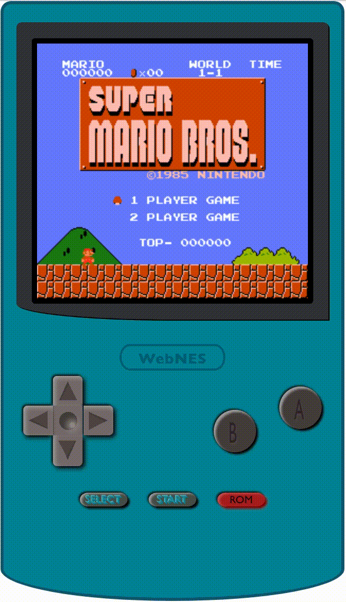
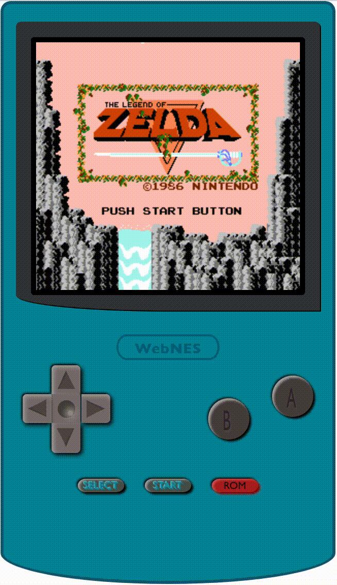

## NesTs Nintendo Entertainment System (NES) Emulator

[](https://www.gnu.org/licenses/gpl-3.0)

<p float="left" align="center">
	
	
	
</p>

### Summary

You can play online demo [HERE](https://ognis1205.github.io/nests/). TypeScript/React.js NES emulator implementation for My Own Learning Porpose. The implementation is NOT fully faithfull to the original NES hardware and some codes are still messy.

### Getting Started

 1. Run the following command in the project root directory to install dependencies:

```bash
 $ npm install && npm run build
```

 2. After the installation, you can start the server by the following command in the project root directory:
 
 ```bash
 $ npm start
```

### Running Development Server

 1. If you want to run the development server, simply run the following command in the project root directory:

```bash
 $ npm run dev
```

 2. Open [http://localhost:3000](http://localhost:3000) with your browser to see the result.

### Key-Mappings

| NES Button | Keyboard |
-------------|----------- 
| →      | Arrow-Right |
| ↓      | Arrow-Down  |
| ←      | Arrow-Left  |
| ↑      | Arrow-Up    |
| SELECT | Space       |
| START  | Return      |
| A      | X           |
| B      | Z           |

### Roadmap

The following is a checklist of features and their progress:
- [x] Console
  - [x] NTSC
- [x] CPU
  - [x] Official Instructions
  - [ ] Unofficial Instructions
  - [x] Interrupts
- [x] PPU
  - [x] VRAM
  - [x] Background
  - [x] Sprites
  - [x] NTSC TV Artifact Effects
  - [x] Emphasize RGB/Grayscale
- [ ] APU
  - [ ] AudioWorklet
  - [x] Pulse Channels
  - [x] Triangle Channels
  - [x] Noise Channels
  - [x] Delta Mulation Channel
- [x] Inputs
- [x] Memory
- [x] Cartridge
  - [ ] Battery-backed Save RAM
  - [x] iNES Format
  - [ ] NES 2.0 Format
  - [ ] Mappers
    - [x] NROM (Mapper 0)
    - [x] SxROM/MMC1 (Mapper 1)
    - [x] UxROM (Mapper 2)
    - [x] CNROM (Mapper 3)
    - [ ] TxROM/MMC3 (Mapper 4)
    - [ ] ExROM/MMC5 (Mapper 5)
- [ ] Misc
  - [ ] Reimplement UI/UX for smartphone users
  - [X] GitHub page
  - [ ] Unit/Integration tests
  - [ ] Refactor Source Codes
  - [X] Error Handling
  - [ ] Documentation
  - [ ] Make Things Responsive
